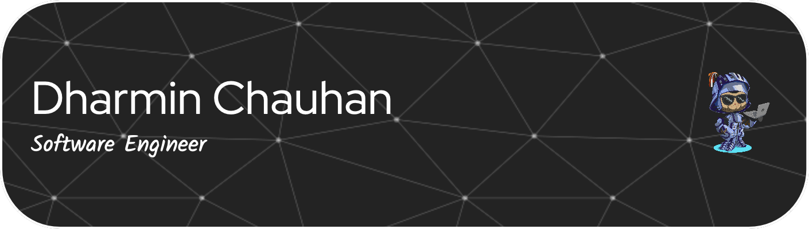

<!--
**DMC09/DMC09** is a ✨ _special_ ✨ repository because its `README.md` (this file) appears on your GitHub profile.

-->


## A little about me... 
```yaml
name: Dharmin Chauhan 🤓
located_in: Houston, Tx 📍
education:
  [
    "B.S. Technology Management Texas A&M University" 🎓
  ]
hobbies:
  [
    "Tennis 🎾",
    "Golf ⛳️" ,
    "Fitness 💪",
  ]
fun_fact: "I was born Ndola, Zambia 🇿🇲"
```

## Reach out to me 

<a href="https://www.linkedin.com/in/dharminchauhan/">
    
</a>
<a href="mailto:Dharminc.dev@gmail.com " target="_blank">
    
</a>


## Technologies/Skills

Front End 


Back End


Testing


Other


